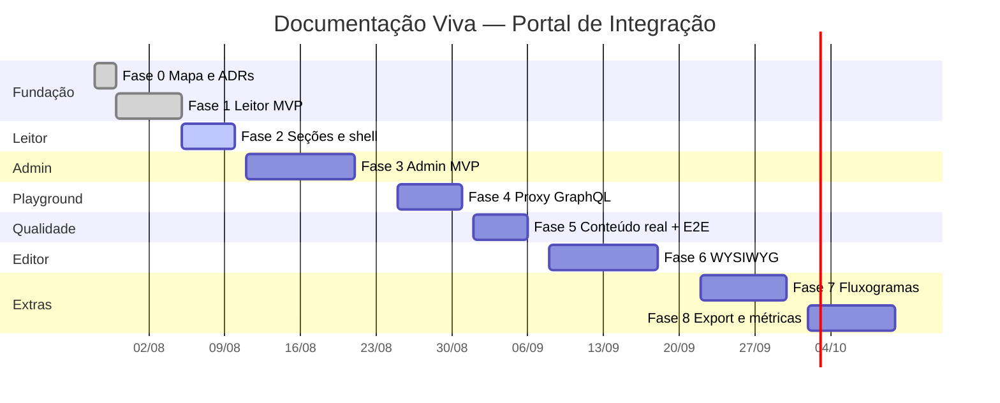

# Cronograma — Documentação Viva no Portal de Integração

> **Início:** 28/jul/2026 · **Módulo:** `living-docs-externa` · **Rota:** `/manual`
>
> Estimativas para 1 dev focado. Ajuste conforme capacidade do time.

---

## Visão das fases



---

## Fase 0 — Mapeamento e decisões (28–29/jul)

**Entregáveis**

- [x] `docs/migracao/mapa-documentacao-funcional.md`
- [x] `docs/migracao/cronograma.md` (este arquivo)
- [x] ADR-0009 — persistência `content` (local + GitHub)
- [x] Atualizar índices (`docs/migracao/README`, ADR README)

**Critério de done:** time alinhado no escopo MVP vs. pós-MVP.

---

## Fase 1 — Leitor MVP (30/jul – 4/ago) ✅

**Objetivo:** distribuidor logado vê catálogo, roteiro e detalhe de operação.

| Entrega | Pasta | Status |
|---------|-------|--------|
| Schemas Zod (`ProjectConfig`, `IntegrationManual`) | `modules/living-docs-externa/schema/` | ✅ |
| Adapter filesystem | `core/db/adapters/local-content-store.ts` | ✅ |
| Repository + services | `repository/`, `services/` | ✅ |
| Telas `/manual`, `/manual/[slug]`, operação | `app/manual/`, `ui/reader/` | ✅ |
| Login mínimo | `app/login/` | ✅ |
| Seed `content/projects/demo/` | `content/` | ✅ |
| Testes unitários (listagem, schemas) | `*.test.ts` | ✅ |
| Módulo `status: active` | `module.ts` | ✅ |

**Critério de done:** `npm run ci` verde; `/manual` lista demo; roteiro renderiza 2 ops. ✅

---

### Fase 2 — progresso por etapas (estudo)

| Etapa | Entrega | Status |
|-------|---------|--------|
| 2.1 | Render `sections/*.md` no roteiro | ✅ |
| 2.2 | `ManualShell` completo (sidebar, TOC) | ✅ |
| 2.3 | Redirect `/projects/*` → `/manual/*` | ✅ |
| 2.4 | Adapter GitHub CMS | ✅ |
| 2.5 | Cache `unstable_cache` + tags | ✅ |

### Fase 3 — progresso por etapas (estudo)

| Etapa | Entrega | Status |
|-------|---------|--------|
| 3.1 | `/admin/projects` listar + criar slug | ✅ |
| 3.2 | Connect gateway | ✅ |
| 3.3 | Sync schema | ✅ |
| 3.4 | Editor operações (form) | ✅ |
| 3.5 | Toggle `published` | ✅ |

---

## Fase 2 — Seções Markdown e shell (5–11/ago)

| Entrega | Detalhe |
|---------|---------|
| Render `sections/*.md` | Markdown no roteiro |
| `ManualShell` completo | header, sidebar, TOC |
| Redirect `/projects/*` → `/manual/*` | `middleware.ts` |
| Adapter GitHub CMS | `core/db/adapters/github-content-store.ts` |
| Cache `unstable_cache` + tags | services |

**Critério de done:** manual demo exibe seções; CMS GitHub opcional em staging.

---

## Fase 3 — Admin MVP (12–22/ago)

| Entrega | Detalhe |
|---------|---------|
| `/admin/projects` CRUD | listar, criar slug |
| Connect gateway | createToken + `credentials.enc` |
| Sync schema | introspection → `schema.json` |
| Editor operações (form) | sem WYSIWYG ainda |
| Toggle `published` | visibilidade distribuidor |
| APIs BFF | `app/api/living-docs/projects/` |
| SSRF guard | `core/security/gateway-url.ts` |

**Critério de done:** EDI conecta gateway homolog, sync, cura 2 ops, publica; distribuidor vê.

---

## Fase 4 — Playground (25–30/ago)

| Entrega | Detalhe |
|---------|---------|
| `/manual/[slug]/playground` | Monaco ou textarea MVP |
| `POST /api/living-docs/[slug]/graphql` | proxy + token master |
| Allowlist | só ops do `manual.json` |
| Testes allowlist + proxy mock | vitest |

**Critério de done:** distribuidor executa query allowlisted; op fora da lista → 403.

---

## Fase 5 — Conteúdo real e E2E (1–5/set)

| Entrega | Detalhe |
|---------|---------|
| Script migração | `scripts/migrate-content-from-legacy.ts` |
| Projetos `im` + `wholesaler` | conteúdo produção homolog |
| Playwright E2E | catálogo → roteiro → operação |
| Smoke SSO homolog | checklist manual |

**Critério de done:** paridade visual/conteúdo com portal antigo para IM.

---

## Fase 6 — Editor WYSIWYG (8–19/set)

| Entrega | Detalhe |
|---------|---------|
| Editor unificado | port de `wysiwyg/*` simplificado |
| Inline edit seções | slide-overs operações |
| Quality checklist | `manual-quality` service |
| Deprecar rotas legacy | redirect `/curate` → `/edit` |

**Critério de done:** EDI edita manual na mesma tela que distribuidor vê.

---

## Fase 7 — Fluxogramas (22/set – 1/out)

| Entrega | Detalhe |
|---------|---------|
| Módulo `fluxogramas` | `integrationFlow` BPMN |
| Canvas React Flow | port seletivo do legado |
| Template canal-autorizador | seed |

**Critério de done:** manual com fluxo editável e export Mermaid.

---

## Fase 8 — Extras (2–13/out)

| Entrega | Detalhe |
|---------|---------|
| Export Postman/PDF | APIs export |
| Métricas playground | in-memory ou banco |
| Busca Ctrl+K | Fuse index |
| Guias transversais | `manuais-internos` ou `/docs/guides` |

**Critério de done:** paridade funcional com portal antigo (exceto clientes legados).

---

## Riscos e dependências

| Risco | Mitigação |
|-------|-----------|
| WYSIWYG subestimado | Fase 6 separada; admin form na Fase 3 |
| GitHub CMS indisponível | Adapter local (Fase 1) + GitHub (Fase 2) |
| SSO homolog instável | `DEV_AUTH_ENABLED` + testes unitários |
| Conteúdo desatualizado | Script migração versionado |
| iCloud/OneDrive no path | `.gitignore` + doc em mapa-projeto |

---

## Comandos de acompanhamento

```bash
npm run ci                    # gate completo
npm run arch                  # fronteiras de módulo
npm run test                  # unitários
npm run dev                   # http://localhost:3002
```

Atualize este cronograma ao concluir cada fase (marque checkboxes na Fase 0 mapa §10).
